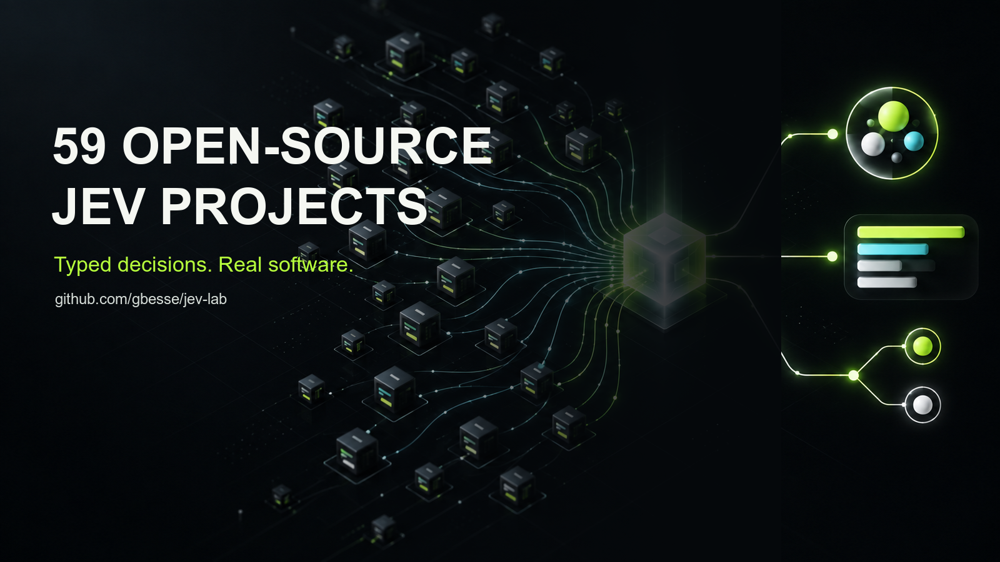

# Jev Lab

**59 open-source projects exploring what changes when AI returns typed decisions instead of prose.**

This is Guillaume Besse's independent lab for building with [Jev](https://typesafe.ai/), TypeSafe AI's System One model. The projects cover production infrastructure, evaluation, research workflows, agent safety, creative tools, public data and native integrations.

Most repositories include an offline demo or fixtures, tests, explicit safety boundaries and a path to the live Jev API. Start with one project, run it locally, and open an issue with what breaks.

> Independent work, not affiliated with TypeSafe AI. Repositories marked alpha are experiments, not production guarantees. Synthetic fixtures are identified as such; measured results include their reproduction protocol.

## Start here

| Project | What it does | Why start here |
| --- | --- | --- |
| [Jev Rerank](https://github.com/gbesse/jev-rerank-server) | Drop-in Cohere, Jina and Voyage-compatible rerank API | Includes a reproducible BEIR SciFact benchmark and framework integration notes |
| [DecisionPacks](https://github.com/gbesse/decisionpacks) | Versioned, testable contracts around typed model decisions | Runs an offline demo in 30 seconds with no key or dependencies |
| [Jev Proxy](https://github.com/gbesse/jev-proxy) | Policy firewall for MCP tool calls | Concrete allow, deny, approval and audit flow for agents |
| [Jev Screen](https://github.com/gbesse/jev-screen) | Systematic-review title and abstract screening | Human-review workflow, PRISMA counts and RIS export |
| [Jev Codebook](https://github.com/gbesse/jev-codebook) | Qualitative coding at scale | Review uncertainty and compare agreement with human coders |
| [Jev Utility](https://github.com/gbesse/jev-utility) | Converts probabilities and mistake costs into actions | Makes thresholds and escalation bands explicit |

## Try one project first

[Three offline paths in French, English and Spanish](START-HERE.md) lead to a decision contract, a pairwise audit and a Unity gateway request. Each uses synthetic fixtures and includes its own runnable command.

## The map

### Decision infrastructure

[decisionpacks](https://github.com/gbesse/decisionpacks) · [jev-decisionops](https://github.com/gbesse/jev-decisionops) · [jev-utility](https://github.com/gbesse/jev-utility) · [jev-timemachine](https://github.com/gbesse/jev-timemachine) · [decision-conformance](https://github.com/gbesse/decision-conformance) · [decision-migrate](https://github.com/gbesse/decision-migrate) · [decision-solver](https://github.com/gbesse/decision-solver) · [intentbus](https://github.com/gbesse/intentbus) · [jev-cardgen](https://github.com/gbesse/jev-cardgen) · [decision-hub](https://github.com/gbesse/decision-hub)

### Data, evaluation and research

[jev-codebook](https://github.com/gbesse/jev-codebook) · [jev-screen](https://github.com/gbesse/jev-screen) · [jev-label](https://github.com/gbesse/jev-label) · [jev-pairs](https://github.com/gbesse/jev-pairs) · [jev-extract](https://github.com/gbesse/jev-extract) · [jev-columns](https://github.com/gbesse/jev-columns) · [jev-rerank-server](https://github.com/gbesse/jev-rerank-server) · [jev-banc-francais](https://github.com/gbesse/jev-banc-francais) · [jev-tar](https://github.com/gbesse/jev-tar) · [jev-crowdsim](https://github.com/gbesse/jev-crowdsim) · [jev-duelarena](https://github.com/gbesse/jev-duelarena) · [jev-judgmentwall](https://github.com/gbesse/jev-judgmentwall) · [jev-fingerprint](https://github.com/gbesse/jev-fingerprint) · [jev-roast](https://github.com/gbesse/jev-roast) · [jev-meetingpulse](https://github.com/gbesse/jev-meetingpulse)

### Safety, compliance and audit

[jev-proxy](https://github.com/gbesse/jev-proxy) · [jev-trace](https://github.com/gbesse/jev-trace) · [jev-regwatch](https://github.com/gbesse/jev-regwatch) · [jev-pii](https://github.com/gbesse/jev-pii) · [jev-brandsafety](https://github.com/gbesse/jev-brandsafety) · [meaning-diff](https://github.com/gbesse/meaning-diff) · [catalog-repair](https://github.com/gbesse/catalog-repair)

### Developer, design and creative tools

[blender-jev-review](https://github.com/gbesse/blender-jev-review) · [jev-obs-cues](https://github.com/gbesse/jev-obs-cues) · [jev-vscode-review](https://github.com/gbesse/jev-vscode-review) · [roblox-jev-studio](https://github.com/gbesse/roblox-jev-studio) · [jev-unreal-statetree](https://github.com/gbesse/jev-unreal-statetree) · [jev-premiere-markers](https://github.com/gbesse/jev-premiere-markers) · [figma-jev-review](https://github.com/gbesse/figma-jev-review) · [bevy-jev](https://github.com/gbesse/bevy-jev) · [worldkit](https://github.com/gbesse/worldkit)

### France and public data

[jev-legifrance-impact](https://github.com/gbesse/jev-legifrance-impact) · [jev-openfisca-intake](https://github.com/gbesse/jev-openfisca-intake) · [jev-hemicycle](https://github.com/gbesse/jev-hemicycle) · [jev-marches](https://github.com/gbesse/jev-marches) · [jev-mistral-reflex](https://github.com/gbesse/jev-mistral-reflex) · [jev-datagouv-join](https://github.com/gbesse/jev-datagouv-join) · [jev-marianne](https://github.com/gbesse/jev-marianne) · [decision-workbench](https://github.com/gbesse/decision-workbench)

### Native platform integrations

[node-red-contrib-jev-decisions](https://github.com/gbesse/node-red-contrib-jev-decisions) · [camunda-jev-connector](https://github.com/gbesse/camunda-jev-connector) · [directus-extension-jev](https://github.com/gbesse/directus-extension-jev) · [temporal-jev-decisions](https://github.com/gbesse/temporal-jev-decisions) · [django-jev-decisions](https://github.com/gbesse/django-jev-decisions) · [unity-jev-behavior](https://github.com/gbesse/unity-jev-behavior) · [wordpress-jev-rules](https://github.com/gbesse/wordpress-jev-rules)

### Markets, risk and playful experiments

[jev-exposure-radar](https://github.com/gbesse/jev-exposure-radar) · [jev-contract-graph](https://github.com/gbesse/jev-contract-graph) · [jev-bluffcall](https://github.com/gbesse/jev-bluffcall)

## What these projects test

The common hypothesis is deliberately narrow: many software decisions do not need another paragraph of generated text. They need a bounded choice, a score or a probability, plus deterministic rules for what happens next.

Across the lab, the recurring engineering pattern is:

```text
state + declared questions
        ↓
typed model judgment + probability
        ↓
validation + deterministic policy
        ↓
act / review / abstain + provenance
```

The projects disagree on implementation details on purpose. Some optimize for latency, some for auditability, some for human review, and some simply test whether a surprising integration is useful.

## Contribute

- Try one of the six starting projects and report a reproducible issue.
- Propose a use case by opening a [project submission](https://github.com/gbesse/jev-lab/issues/new?template=submit-project.yml).
- Submit an independent Jev project; this directory is not limited to repositories owned by `gbesse`.
- Follow [@guyom](https://x.com/guyom) for build notes, benchmarks and weekly project roundups.
